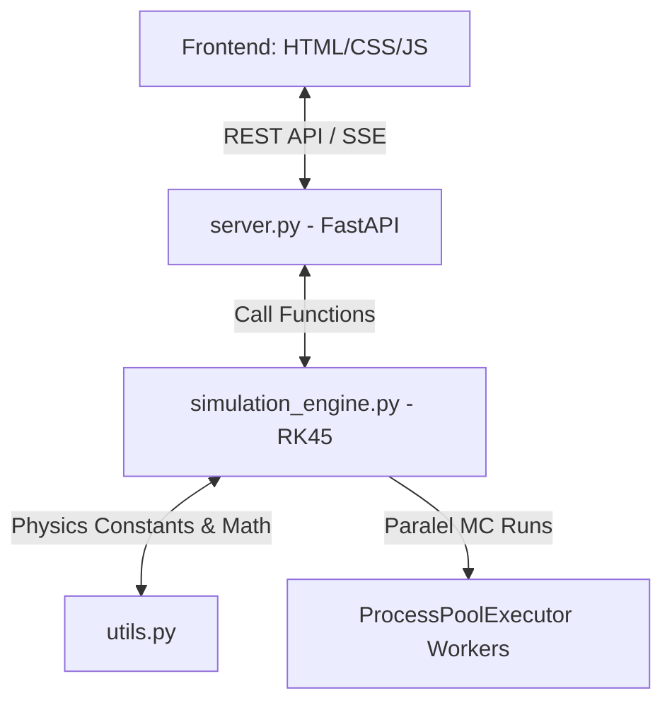

# 🌍 Panduan Migrasi & Dokumentasi Simulator Asteroid Skjold-9

Dokumen ini berisi daftar perubahan, arsitektur baru, cara menjalankan, serta cara mengakses simulator asteroid **Skjold-9** versi web.

---

## 🛠️ Ringkasan Perubahan

Kami telah memigrasikan simulator dari aplikasi desktop berbasis Dear PyGui ke aplikasi web modern berbasis **FastAPI (Backend)** dan **HTML5/Vanilla CSS/JavaScript (Frontend)**.

### File Baru yang Dibuat:
1. **[simulation_engine.py](file:///c:/Users/rasen/skjold9_sim/simulation_engine.py)**: Modul fisika orbital utama yang membungkus persamaan diferensial (ODE) pergerakan Matahari, Bumi, dan Asteroid. Mendukung integrasi RK45 (`scipy`), simulasi Monte Carlo paralel (`ProcessPoolExecutor`), dan simulasi deviasi anomali.
2. **[server.py](file:///c:/Users/rasen/skjold9_sim/server.py)**: Server FastAPI yang melayani file frontend statis serta menyediakan endpoint REST API dan SSE (Server-Sent Events) untuk data Monte Carlo secara real-time.
3. **[web/index.html](file:///c:/Users/rasen/skjold9_sim/web/index.html)**: Struktur halaman antarmuka pengguna dengan sidebar kontrol parameter, area visualisasi orbit, panel statistik, dan grafik statistik.
4. **[web/css/style.css](file:///c:/Users/rasen/skjold9_sim/web/css/style.css)**: Sistem desain bernuansa ruang angkasa gelap (*dark space theme*) yang indah dengan panel *glassmorphic*, slider berpendarkan cahaya (*glow effects*), starfield animasi latar belakang, dan transisi mikro yang halus.
5. **[web/js/api-client.js](file:///c:/Users/rasen/skjold9_sim/web/js/api-client.js)**: Modul komunikasi API yang menangani REST request dan SSE stream (fetch + ReadableStream).
6. **[web/js/orbit-renderer.js](file:///c:/Users/rasen/skjold9_sim/web/js/orbit-renderer.js)**: Engine visualisasi orbit berbasis HTML5 Canvas 2D. Menampilkan visualisasi Matahari (dengan pendaran radial dinamis), orbit Bumi, serta trajektori asteroid (warna bergradasi hijau-ke-merah tergantung jaraknya ke Bumi) dengan interaksi zoom/pan yang mulus.
7. **[web/js/app.js](file:///c:/Users/rasen/skjold9_sim/web/js/app.js)**: Pengontrol utama frontend yang menangani penyesuaian parameter secara real-time (dengan debounce 300ms), mengikat interaksi UI, serta merender diagram deviasi (SVG) dan histogram jarak minimum (HTML bars).

### File yang Dimodifikasi:
- **[requirements.txt](file:///c:/Users/rasen/skjold9_sim/requirements.txt)**: Menghapus modul desktop yang tidak digunakan (`dearpygui`, `astropy`, `poliastro`, `jupyterlab`) dan menambahkan pustaka web backend (`fastapi`, `uvicorn`, `sse-starlette`).
- **[sim_1_basic_2body.py](file:///c:/Users/rasen/skjold9_sim/sim_1_basic_2body.py)**: Di-refactor untuk menggunakan modul konstanta `utils.py` dan menonaktifkan grafik GUI (menggunakan `matplotlib` Agg backend).
- **[sim_2_anomaly_hidden.py](file:///c:/Users/rasen/skjold9_sim/sim_2_anomaly_hidden.py)**, **[sim_3_optimized.py](file:///c:/Users/rasen/skjold9_sim/sim_3_optimized.py)**, **[sim_3_monte_carlo_impact_prob.py](file:///c:/Users/rasen/skjold9_sim/sim_3_monte_carlo_impact_prob.py)**: Menghapus konfigurasi path Tcl/Tk Windows hardcoded yang membatasi jalannya kode di komputer lain.
- **[README.md](file:///c:/Users/rasen/skjold9_sim/README.md)**: Membersihkan script PowerShell pembungkus yang tidak sengaja tertinggal pada awal dan akhir file agar terdokumentasi rapi di GitHub.
- **[engine.py](file:///c:/Users/rasen/skjold9_sim/engine.py)**: Dihapus karena rusak dan digantikan oleh `simulation_engine.py`.

---

## 🏗️ Arsitektur Aplikasi & Alur Data



1. **Parameter Tuning Real-time**:
   Ketika slider parameter asteroid diubah pada panel kontrol sebelah kiri, event listener akan menangkap nilai baru, memperbarui state di frontend, dan melakukan debounce selama 300ms untuk mencegah spam request. Jika tidak ada perubahan baru setelah 300ms, request POST dikirim ke `/api/simulate/trajectory` dan visualisasi orbit langsung terupdate secara interaktif.
2. **Streaming Monte Carlo**:
   Request dikirim ke `/api/simulate/monte-carlo`. Backend akan membagi tugas simulasi acak ke beberapa core CPU secara paralel menggunakan `ProcessPoolExecutor`. Setiap kali satu simulasi selesai, progress akan di-stream kembali ke frontend via Server-Sent Events (SSE). UI akan mengupdate progress bar secara langsung hingga hasil akhir diterima dan histogram jarak minimum ditampilkan.
3. **Perbandingan Anomali (Outgassing)**:
   Backend mensimulasikan lintasan ideal (gravitasi murni) dan lintasan nyata (dengan tambahan percepatan anomali non-gravitasi). Frontend menerima kedua lintasan tersebut, menampilkannya berdampingan (lintasan prediksi bertitik hijau, lintasan nyata garis merah solid), serta menggambar grafik garis deviasi (SVG) berskala logaritmik dengan garis batas deviasi 10.000 km.

---

## 🚦 Cara Menjalankan Aplikasi

Aplikasi berjalan di lingkungan Python yang telah dikonfigurasi. Berikut langkah-langkah detail untuk mengaktifkan environment dan menjalankan server secara lokal di Windows:

### Langkah 1: Buka Terminal & Masuk ke Folder Proyek
Buka PowerShell atau Command Prompt (CMD) di Windows, kemudian arahkan ke direktori proyek:
```powershell
cd c:\Users\rasen\skjold9_sim
```

### Langkah 2: Aktifkan Virtual Environment
Pilih perintah di bawah ini sesuai dengan jenis shell yang Anda gunakan:

- **Jika menggunakan PowerShell:**
  ```powershell
  .\venv\Scripts\Activate.ps1
  ```
  *(Catatan: Jika muncul error kebijakan eksekusi atau script execution policy blocked, jalankan `Set-ExecutionPolicy -ExecutionPolicy RemoteSigned -Scope Process` di sesi PowerShell tersebut sebelum menjalankan skrip aktivasi).*

- **Jika menggunakan Command Prompt (CMD):**
  ```cmd
  .\venv\Scripts\activate.bat
  ```

Setelah berhasil diaktifkan, indikator `(venv)` akan muncul di sebelah kiri baris input terminal Anda.

### Langkah 3: Instalasi Dependensi (Jika Diperlukan)
Untuk memastikan seluruh pustaka backend terinstal sempurna:
```powershell
pip install -r requirements.txt
```

### Langkah 4: Jalankan Server FastAPI
Jalankan file server utama [server.py](file:///c:/Users/rasen/skjold9_sim/server.py) menggunakan perintah:
```powershell
python server.py
```

---

### 💡 Alternatif Cara Cepat (Tanpa Aktivasi Manual)
Anda juga dapat langsung memanggil eksekutor Python di dalam virtual environment secara langsung tanpa perlu melakukan proses aktivasi shell terlebih dahulu:
```powershell
.\venv\Scripts\python server.py
```
*Server akan otomatis berjalan dan melayani halaman visualisasi pada port 8000.*

---

## 🔗 Cara Mengakses

Setelah server aktif, gunakan browser Anda untuk mengakses endpoint berikut:

| Nama Halaman / Endpoint | URL Akses | Deskripsi |
| :--- | :--- | :--- |
| **Aplikasi Utama** | [http://localhost:8000/](http://localhost:8000/) | Antarmuka interaktif visualisasi simulator asteroid Skjold-9. |
| **Dokumentasi API (Swagger)** | [http://localhost:8000/docs](http://localhost:8000/docs) | Halaman uji coba API interaktif yang otomatis dibuat oleh FastAPI. |
| **JSON Schema API** | [http://localhost:8000/openapi.json](http://localhost:8000/openapi.json) | Spesifikasi OpenAPI untuk backend server. |
| **API Defaults** | [http://localhost:8000/api/defaults](http://localhost:8000/api/defaults) | Mengembalikan parameter bawaan/default awal sistem. |
| **Health Check** | [http://localhost:8000/api/health](http://localhost:8000/api/health) | Status kesehatan server (`{"status": "ok"}`). |

---

## 🐛 Log Perbaikan Bug Penting

Selama proses migrasi dan pengujian akhir, kami mengidentifikasi dan memperbaiki masalah berikut:

1. **Error 404 pada Aset Statis**:
   *Penyebab*: Server FastAPI awalnya me-mount direktori statis di `/static`, namun `index.html` merujuk langsung ke `css/style.css` dan `js/app.js`.
   *Solusi*: Memodifikasi `server.py` untuk me-mount `/css` dan `/js` secara terpisah, memastikan semua asset terhubung dengan benar.
2. **Error Unicode Encoding saat Startup**:
   *Penyebab*: Konsol Windows dengan codepage bawaan (`cp1252`) gagal mengodekan karakter Unicode non-ASCII (seperti emoji batu `🪨` dan tanda hubung em dash `—`) yang dicetak ke stdout saat server dimulai.
   *Solusi*: Mengganti karakter tersebut dengan teks ASCII standar pada fungsi `startup_event()` di `server.py`.
3. **Error 422 (Unprocessable Content) pada Simulasi**:
   *Penyebab*: Fungsi `_applyDefaults()` di frontend salah memetakan respons dari `/api/defaults` (yang berstruktur objek bersarang seperti `defaults.trajectory`). Akibatnya, `this.state.anomaly` terisi dengan *object/dictionary* alih-alih nilai *boolean*. Ketika dikirim ke endpoint `/api/simulate/trajectory`, validasi Pydantic backend menolaknya karena tipe data tidak sesuai.
   *Solusi*: Memperbarui `_applyDefaults()` di `web/js/app.js` agar membaca key dari properti child yang sesuai (`defaults.trajectory` dan `defaults.monte_carlo`), menjaga state parameter tetap bernilai numerik dan boolean yang valid.
